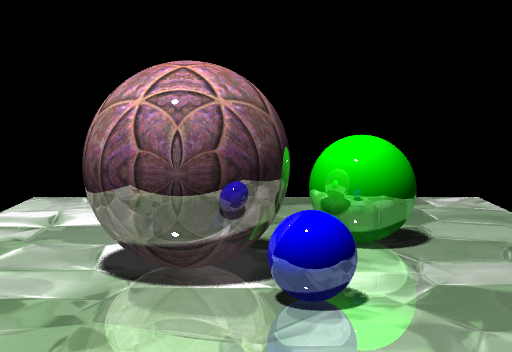

Ray Tracer
============

**Generated Images from this Ray Tracer**

Features
----------

Ray tracing with spheres, triangles, box antialiasing filter, texture mapping, shadows, reflection of arbitrary depth, lighting that assumes spherical or triangular shapes, and arbitrary view points.

Configuration
-----------------

**Command Format**

ambient r g b   - Specifies ambient light of the scene.
pixelsamples n  - n*n is the number of samples to trace through each pixel.
lightsamples n  - n*n is the number of samples to take of each light source.
depth n         - n is the recursion depth for specular surfaces.

**Spheres Format**

center.x center.y center.z radius [diffuse | texture | light] [diffuse.x diffuse.y diffuse.z | textureFileName.ppm | emit.x emit.y emit.z]

**Triangles Format**

x0 y0 z0 u0 v0 x1 y1 z1 u1 v1 x2 y2 z2 u2 v2 [diffuse, texture, light] [diffuse.x diffuse.y diffuse.z, textureFileName.ppm, emit.x emit.y emit.z]
    

**Build Instructions**

1.  Type in terminal: g++ -ansi -pedantic prog4.cpp -o prog4
2.  Type in terminal: ./prog4 512 512 settings.txt output.ppm
3.  View output.ppm for final image.  

